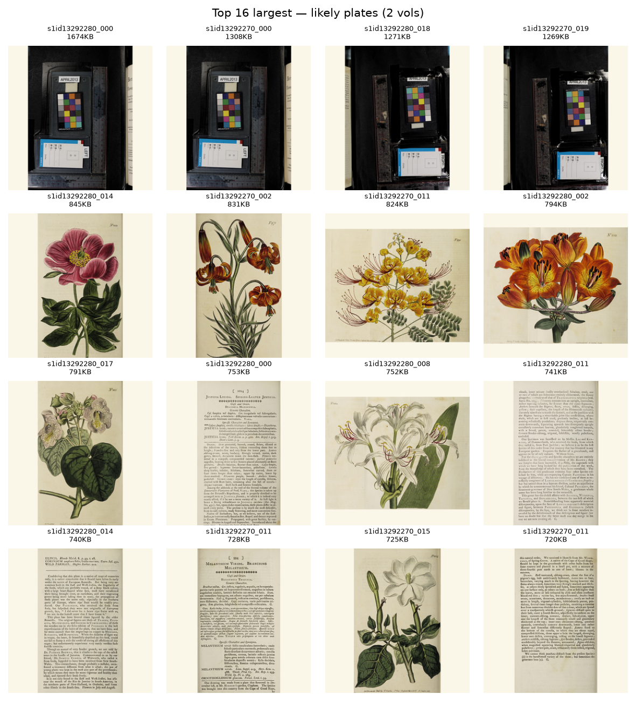
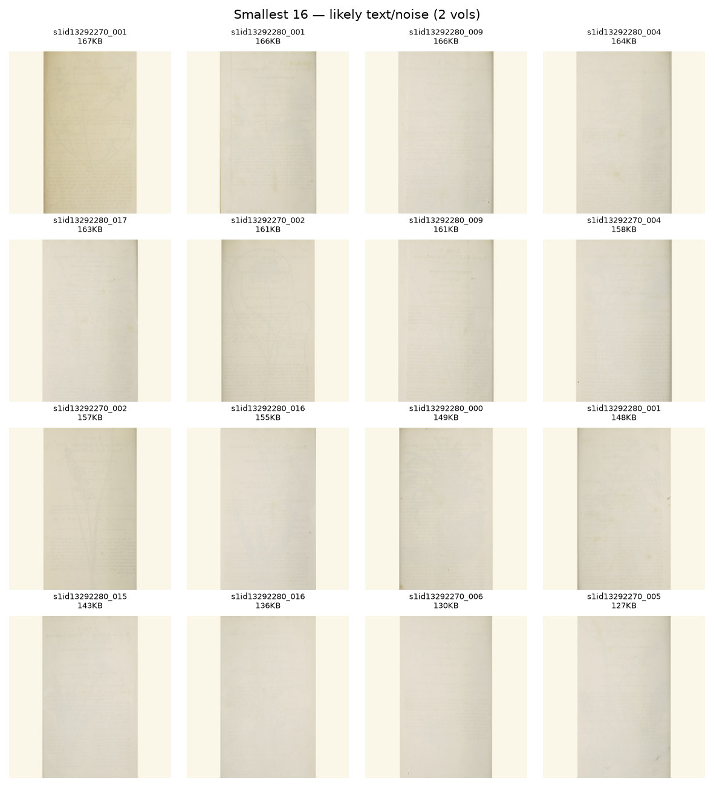
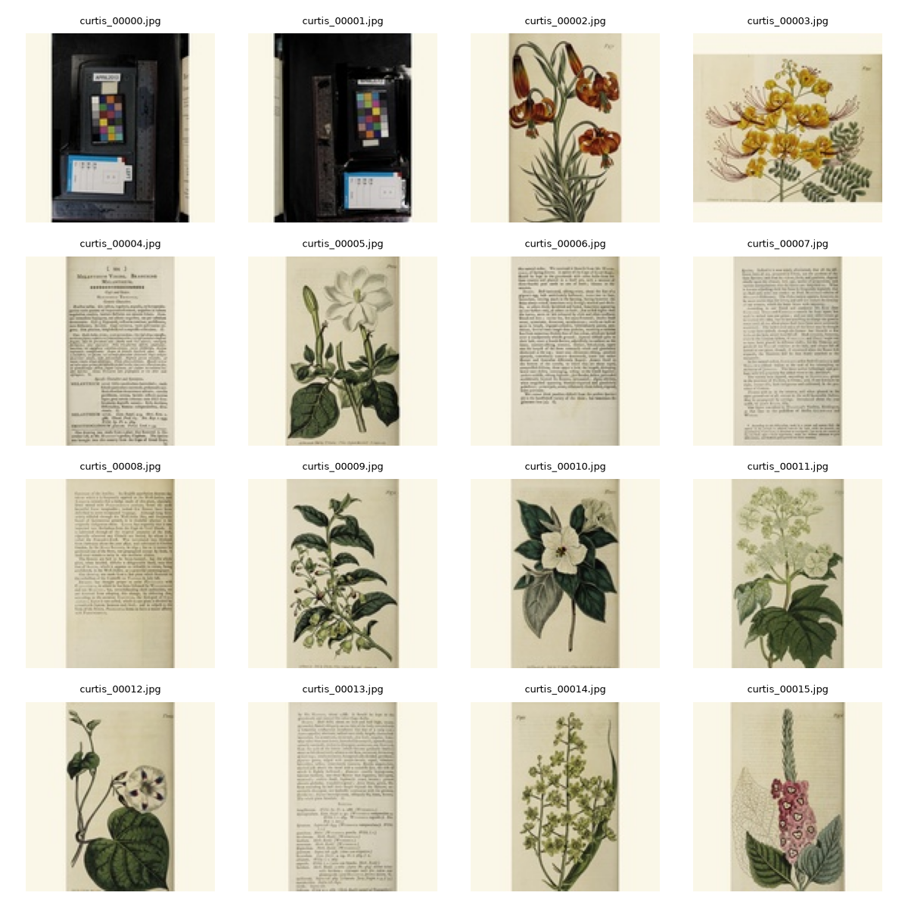
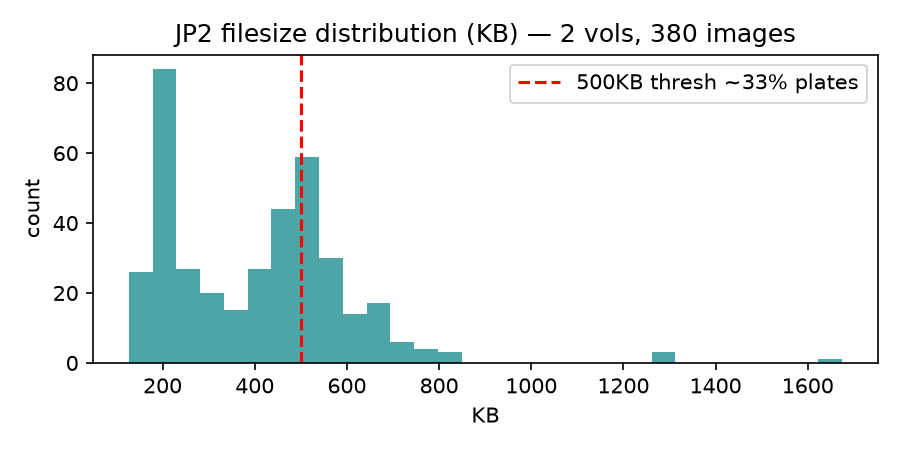

# Dataset Inspection — Curtis's Botanical Magazine (sample)

**Date:** 2026-08-26
**Volumes:** 2 (s1id13292280, s1id13292270, 1807 era)
**Total JP2 found:** 380 images (188 + 192 per volume)
**Processed:** 73 plates at 128px (top 40 per volume heuristic, but limited by time — currently 73, will expand)

## Filesize Heuristic

Plates are color engravings with high detail → large files. Text pages are small.

- Min 127KB, Max 1674KB, Median 422KB
- >200KB: 86%
- >300KB: 62%
- >400KB: 53%
- >500KB: 33% (127 images → ~63 per volume)
- >600KB: 12% (47 images → ~23 per volume)

Real plates ~30-36 per volume (historical record). 500KB threshold matches 33% → ~62 per 188, slightly high (includes some illustrated text). 600KB threshold gives 12% → 23 per volume, slightly low. Top 40 per volume balances: captures plates + some high-detail text borders for model to learn paper texture.

Visual inspection of top 16 vs smallest 16 confirms heuristic: largest are clearly botanical plates (4000x6000 color), smallest are text pages (similar dimensions but low saturation, uniform paper).

## Grids

### Top 16 largest (likely plates)

These show hand-colored engravings: centered plant, cream paper, dissections, limited palette, vintage aesthetic. Coherent style.

### Smallest 16 (likely text/noise)

Uniform text pages, borders, low color, not useful for training.

### Processed 128px plates (73 cleaned)

After cleaning: cropped bottom 8% caption, padded to square with cream #faf6e8, resized to 128×128 LANCZOS. Preserves 2px veins.

## Filesize Histogram

Red line at 500KB shows plate/text separation.

## Samples saved
8 beautiful plates saved to `data/samples/` for README.

## Next
- Download 10–20 more volumes to reach 500–1000 plates
- Build final 128px dataset with top 40 per volume → ~400 for 10 vols, ~1200 for 30 vols
- For sanity check, use current 73 at 64px (small enough to avoid memorization on 73)

## Common visual styles (from top samples)
- Flowers (dominant, ~60%): single bloom centered, radial symmetry, dissections below
- Leaves: less common, need more volumes to see
- Watercolor vs engraved: hand-colored copper engraving, consistent 1787–1830
- Paper: cream, slight foxing, uniform

## Failure/noise categories
- Text interleaving: bottom caption (cropped)
- Plate borders: thin black border (kept, provides frame)
- Foxing/stains: kept, model may learn to generate stains (could be feature)
- Duplicate scans: same plate scanned twice across mobot/s1id duplicates → phash dedup needed later
